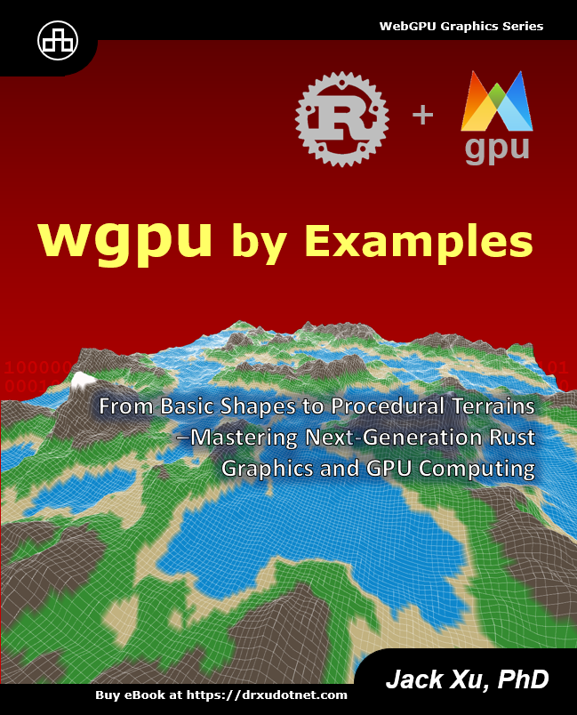

# wgpu Graphics Programming in Rust: Step-by-Step 

$$\textcolor{red}{\text{Good news: all code examples have been updated from wgpu 0.13.1 to 0.17.}}$$

*wgpu* is based on the WebGPU standard. It is a cross-platform, safe, pure Rust graphics API that runs natively on Vulkan, Metal, DirectX 12, DirectX 11, and OpenGLES, as well as on the web via WebAssembly. I have created a YouTube video series about *wgpu* programming in Rust, presenting an easy-to-follow wgpu application in each video episode. This repository contains all the code examples used in this video series.

In this YouTube video series, I use real-world sample apps to explain the basics of wgpu, including shader programs, GPU buffers, and rendering pipelines. Throughout the series, you will learn how to create primitives and simple objects in Rust with wgpu. As you progress, you will delve into advanced wgpu topics, such as 3D transformations, lighting calculations, colormaps, and textures. Simultaneously, you will discover how to create advanced 3D wgpu objects, including various 3D wireframes, 3D shapes, simple and parametric 3D surfaces with colormaps and textures, and 3D surface plots. Additionally, you will explore new wgpu features, such as compute shaders and storage buffers, and learn how to use them to 3D graphics.

By the end of this video series, you will have the solid skills you need to build your own GPU-accelerated graphics and computing applications on native devices and the web using the wgpu API in Rust. 

 

## Books on Rust wgpu
Most of the examples used in this video series are taken from my recently published books **"Practical GPU Graphics with wgpu and Rust"** and **"WGPU by Examples"**

&nbsp;&nbsp;&nbsp; 

Please see details about these books at https://drxudotnet.com. 

 

## YouTube Video Links:

Please visit my YouTube channel: [Practical Programming with Dr. Xu](https://www.youtube.com/c/PracticalProgrammingWithDrXu)

### Video Series for Rust wgpu Step-by-Step:

1. Introduction to *wgpu*: https://youtu.be/i6WMfY-XTZE
2. Set up Development Environment: https://youtu.be/LULQtc5CUJ8 
3. Create a Colorful Triangle: https://youtu.be/hOojFOho_lI
4. Create Point and Line Primitives: https://youtu.be/-QXj0UexUw0
5. Create Triangle Primitives: https://youtu.be/TFVjMmSRDxs
6. Create a Square using GPU Buffer: https://youtu.be/GIEjzG2wwJY
7. Create a 3D Cube: https://youtu.be/ai53VFoqdJQ
8. Animate a 3D Cube: https://youtu.be/9SsjhrxH08o
9. Light Model: https://youtu.be/YF6VepGkUJs
10. Cube with Lighting: https://youtu.be/mPbsgFYb2z8
11. Sphere with Lighting: https://youtu.be/2bW_uCOKiKc
12. Torus with Lighting: https://youtu.be/CC3stU82iZg
13. Colormap: https://youtu.be/D0wrVy7lAcg
14. 3D Simple Surfaces: https://youtu.be/XfVeMrumi7o
15. 3D Sinc Surface: https://youtu.be/O7xIQudPKmA
16. 3D Peaks Surface: https://youtu.be/6d5l2huTm9E
17. Parametric 3D Surfaces: https://youtu.be/ODLGjzR9mWY
18. Parametric 3D Surface Examples: https://youtu.be/AjDU7eegt4g

 

## Sample Objects 
Here are some sample objects created using the *wgpu* API, which I will discussed in my video series.

### Klein Bottle and Wellenkugel Surface:
 &nbsp;&nbsp;&nbsp;&nbsp;&nbsp;&nbsp;  

### Snail Shell and Sievert-Enneper Surface:
 &nbsp;&nbsp;&nbsp; 

### Breather Surface and 3D Sinc Surface:
 &nbsp;&nbsp;&nbsp;  

### Multiple-Textures:
 

 

## License

The MIT License (MIT).

Copyright (c) 2022 Jack Xu.

Permission is hereby granted, free of charge, to any person obtaining a copy of this software and associated documentation files (the "Software"), to deal in the Software without restriction, including without limitation the rights to use, copy, modify, merge, publish, distribute, sublicense, and/or sell copies of the Software, and to permit persons to whom the Software is furnished to do so, subject to the following conditions:

The above copyright notice and this permission notice shall be included in all copies or substantial portions of the Software.

THE SOFTWARE IS PROVIDED "AS IS", WITHOUT WARRANTY OF ANY KIND, EXPRESS OR IMPLIED, INCLUDING BUT NOT LIMITED TO THE WARRANTIES OF MERCHANTABILITY, FITNESS FOR A PARTICULAR PURPOSE AND NONINFRINGEMENT. IN NO EVENT SHALL THE AUTHORS OR COPYRIGHT HOLDERS BE LIABLE FOR ANY CLAIM, DAMAGES OR OTHER LIABILITY, WHETHER IN AN ACTION OF CONTRACT, TORT OR OTHERWISE, ARISING FROM, OUT OF OR IN CONNECTION WITH THE SOFTWARE OR THE USE OR OTHER DEALINGS IN THE SOFTWARE.
 
